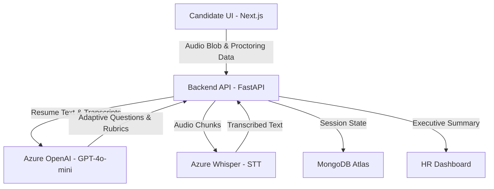

# AI Full Stack Project Submission: Professional Report

## 1. Project Overview

*   **Project Title:** AI Interview Bot Ecosystem (v2.0 Enhanced)
*   **Student Details:** [YOUR_NAME / YOUR_DETAILS]
*   **Problem Statement:**
    Traditional recruitment processes are plagued by volume overload, subjective bias, and the high cost of manual screening. HR teams spend 30% of their time on first-round technical interviews that could be automated, while candidates often provide vague answers that don't reflect their true potential.
*   **Objective of the Project:**
    To build an "AI-Native Intelligent Gatekeeper" that automates resume analysis and conducts adaptive, voice-based technical interviews. The system aims to protect recruitment integrity through multi-layered proctoring while providing objective, rubric-based competency scoring for HR teams.
*   **Applications:**
    - Corporate Recruitment & Talent Acquisition.
    - Campus Hiring & Large-Scale Technical Screenings.
    - Skill Assessment Platforms.
    - Remote Proctoring for Professional Certifications.
*   **SDG Mapping:**
    - **Goal 4: Quality Education**: By providing practice modes and objective feedback, the system helps candidates identify and bridge their skill gaps.
    - **Goal 8: Decent Work & Economic Growth**: Streamlines the matching process between talent and opportunity, reducing time-to-hire and operational costs for businesses.

---

## 2. System Description

### Overall Architecture
The system utilizes a decoupled, asynchronous micro-architecture. A high-performance React frontend captures real-time candidate biometric data (audio stream/screen focus) and communicates via REST/WebSockets with a Python API. The backend acts as an orchestrator, piping audio to external STT services, managing session persistence in a NoSQL database, and executing prompt chains against large language models for evaluation.

### Technologies Used (Detailed Tech Stack)
| Layer | Technology | Purpose & Architectural Justification |
| :--- | :--- | :--- |
| **Frontend** | **Next.js 14, React 18, Tailwind CSS, Framer Motion** | Next.js for App Router and hybrid rendering. Tailwind for a utility-first 'Glassmorphism' aesthetic. Framer Motion for micro-animations (like audio waveforms) to reduce cognitive load and candidate anxiety. |
| **Backend** | **FastAPI (Python), Uvicorn, Pydantic** | Native `async/await` support is critical when handling long-polling AI API calls and concurrent audio file uploads without thread blocking. Pydantic enforces strict runtime data validation. |
| **AI / ML Layer** | **Azure OpenAI (GPT-4o-mini, Whisper API)** | GPT models handle the core logic layer (adaptive questioning, rubric scoring). Whisper processes highly accurate, resilient real-time Speech-to-Text transcription. |
| **Database** | **MongoDB Atlas, Motor Python Driver** | A NoSQL document store perfectly suits tracking unstructured arrays like interview transcripts and evolving session states without complex database migrations. |
| **Security** | **JWT, Argon2, Browser Web APIs** | Argon2 for state-of-the-art password hashing. HTTP-Only cookies secure the JWT. Web APIs handle Fullscreen/Visibility monitoring. |

### Workflow: User Input to Output
1. **Ingestion**: Candidate uploads a PDF resume. The backend extracts text (`pdfplumber`) and sends it to the AI to construct a structured "Technical Knowledge Graph".
2. **Interaction Initialization**: The browser requests Microphone and Fullscreen permissions, establishing an enforced proctoring environment.
3. **The Interview Loop**:
   - The AI generates an adaptive question (spoken via Text-to-Speech).
   - Candidate answers via microphone; the frontend records the Blob.
   - The audio chunk is sent to backend and transcribed by Whisper.
   - The AI evaluates the answer. If vague, a "Smart Retry" mechanism asks a clarifying follow-up.
4. **Final Output**: The session concludes. The backend Report Engine aggregates transcripts and AI-graded rubric scores (1-10) to generate a markdown/JSON summary for HR recruiters.

---

## 3. Module Description (Deep Dive)

### 🖥️ Frontend Modules
-   **Interview Engine (`interview-chat.tsx`)**: The flagship component. It directly invokes the Web Audio API to capture mic streams and render an animated visual waveform, drastically improving the UI feedback loop. It handles the state machine (`Listening`, `Processing`, `Speaking`) and uses the `SpeechSynthesis` API to vocalize AI prompts.
-   **Proctoring Monitor (`proctoring-monitor.tsx`)**: A silent guardian hooking into native `visibilitychange` and `fullscreenchange` events. It actively detects if a candidate switches tabs or exits max-screen, displays visual warnings, and pushes tamper-logs to the database.
-   **HR Dashboard (`app/dashboard`)**: A secure routing module leveraging React Server Components for heavy data extraction. It displays candidate analytics, allows deep-reads of interview transcripts, and manages customizable logic for new questionnaires.

### ⚙️ Backend Modules
-   **AI Engine (`ai_engine.py`)**: The highest-complexity logic module. It structures dynamic prompts and orchestrates the "5-5-5 Question Pattern":
      1. *Resume Verification*: Deep dives into claimed projects for authenticity.
      2. *Role Alignment*: Scenario-based system design queries.
      3. *Behavioral (HR)*: STAR-method assessments for cultural add.
-   **API Router (`interview_routes.py`)**: Exposes RESTful endpoints. Implements fault-tolerant session persistence so candidates can seamlessly resume their interview in the event of dropped connections.
-   **Auth & Security Services (`security.py`, `auth_service.py`)**: Handles password verification, token issuance, and intercepting unauthorized calls via JWT validation, ensuring robust RBAC (Role-Based Access Control) between Candidates and HR Admins.

### 🗄️ Database Module (Collections)
-   **`users`**: Secure storage for candidate/admin identities, hashed passwords, and organizational roles.
-   **`sessions`**: Ephemeral active documents recording the exact interview state (e.g., Question 3/15, Stage 2), preventing data loss.
-   **`interviews`**: Post-interview archives housing complete bidirectional transcripts, discovered skills matrices, and granular 1-10 scores on defined technical competencies.

### 🤖 Intelligent Assessment Module
-   **Report Engine (`report_engine.py`)**: An asynchronous worker that analyzes raw transcripts using the LLM against defined rubrics. It outputs an "Executive Summary" identifying the candidate's core strengths, weaknesses, and a final hire confidence level.

---

## 4. Functional Requirements
-   [x] **Resume Parsing**: Automatic skill and experience extraction from PDF.
-   [x] **Adaptive Questioning**: AI asks follow-up questions if the candidate's response is too brief.
-   [x] **Voice-to-Text**: Real-time transcription of interview answers.
-   [x] **Integrity Proctoring**: Detection of cheating behaviors (tab switching, copy-pasting).
-   [x] **HR Dashboard**: CRUD operations for question sets, rubrics, and candidate management.
-   [x] **Automated Scoring**: Rubric-based evaluation per competency.

---

## 5. Non-Functional Requirements
-   **Performance**: Backend uses `async` architecture to handle STT and LLM latency efficiently.
-   **Security**: HTTP-Only cookies for JWT; CORS allow-listing for the Chrome Extension.
-   **Scalability**: Stateless backend logic ready for Docker orchestration.
-   **Usability**: Premium "Glassmorphism" UI with dark mode and smooth micro-animations.

---

## 6. Timeline (Development Plan)

| Phase | Task Completed |
| :--- | :--- |
| **Week 1-2** | UI/UX Design & Frontend scaffolding (Next.js). |
| **Week 3-4** | Backend API & MongoDB Schema design. |
| **Week 5-6** | AI Integration (Prompt engineering & STT pipeline). |
| **Week 7** | Proctoring system development (Fullscreen/Tab lock). |
| **Week 8** | HR Dashboard & Testing/Bug fixing. |

---

## 7. Work Summary

### What I Implemented
I developed an end-to-end AI-powered recruitment ecosystem. This includes a resume-driven question engine, a real-time voice interface, and an automated proctoring suite.

### Challenges Faced
1.  **Hydration Mismatches**: Next.js server-side rendering conflicted with random SVG paths in the audio waveform component.
2.  **CORS Barriers**: The Chrome Extension required specialized FastAPI middleware to allow secure cross-origin communication.
3.  **Vague AI Feedback**: Initial AI responses were too polite; I had to implement "Structured Rubric Prompting" to force critical evaluation.

### How I Solved Them
1.  Used a **Client-Only mount pattern** for the waveform component to ensure visual consistency.
2.  Configured **Dynamic CORSMiddleware** that identifies trusted Extension IDs.
3.  Pivoted to **JSON-Schema enforcement** in AI prompts, requiring numeric scores and evidence-based feedback.

---

## 8. Conclusion
**Learning Outcome:** Through this project, I mastered the orchestration of LLMs within an asynchronous web architecture and learned how to build high-integrity systems using modern browser APIs.
**Outcome:** A fully functional prototype that significantly reduces the time-to-hire while maintaining high evaluation standards.
**Future Improvements:**
- Integrated Coding Sandbox for real-time algorithmic testing.
- AI Emotion Recognition for behavioral sentiment analysis.
- Multilingual STT support for global hiring.

---

## 9. GitHub & Links
-   **GitHub Repository:** [GITHUB_REPOSITORY_LINK]
-   **Deployment Link:** [DEPLOYMENT_LINK]
-   **Demo Video:** [DEMO_VIDEO_LINK]

### Steps to Run the Project
1.  **Backend**: `cd backend && pip install -r requirements.txt && python -m uvicorn interview_api:app --reload`
2.  **Frontend**: `cd frontend && npm install && npm run dev`
3.  **Config**: Ensure `.env` files are populated with Azure OpenAI and MongoDB URI keys.
